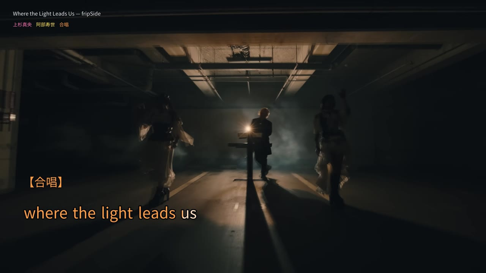

# auto-karaoke

**中文** · [English](README.en.md) · [日本語](README.ja.md)

日语卡拉 OK 视频制作工具。支持音轨分离、歌词对齐、汉字注音、逐词／音拍扫色和歌手配色，输出伴奏与纯人声双轨 MP4。

## 示例

汉字注音、上下交替歌词和歌手配色：


<details>
<summary>片头标题与英文歌词</summary>




</details>

[截图来源](docs/images/README.md)

| Skill | 用途 |
| --- | --- |
| `karaoke-setup` | 检查环境，经授权后安装或修复依赖 |
| `audio-separate` | 从音频或视频中分离伴奏和纯人声 |
| `karaoke-author` | 制作、校对歌词读音与时间轴 |
| `karaoke-render` | 根据字幕数据和分轨生成视频 |

播放器独立维护：[auto-karaoke-player](https://github.com/frip-fans/auto-karaoke-player)。

## 安装

使用 Claude Code？参见 [插件安装说明](plugins/auto-karaoke/README.md#claude-code)。也可以 [手动安装 CLI](docs/manual-install.md)，可直接在终端完成制作。

需要可运行 Codex 的电脑、可用磁盘空间及首次安装时的网络连接。制作工具使用 Python 3.11+、FFmpeg；渲染日语字幕还需要日文字体。分离和对齐建议使用 NVIDIA GPU，CPU 也可运行，但速度较慢。具体模型能否运行，由插件检查硬件和所需后端。

在本仓库根目录安装插件，无需先手动配置 Python 环境：

```bash
codex plugin marketplace add .
codex plugin add auto-karaoke@frip-fans
```

新开 Codex 会话后，告诉它你要做什么：

```text
$karaoke-setup 检查我的电脑，告诉我分离音轨还需要安装什么。
```

Codex 可以先做只读检查。需要安装依赖、创建环境或下载模型时，会列出具体内容和安装位置，询问你是否同意；得到明确授权后才执行。制作 skills 也遵守这一规则。

## 使用

```text
$audio-separate 将这份 MV 分离成伴奏和纯人声，使用 MDX23C。
$karaoke-author 用歌词和分轨制作时间轴，列出需要我校对的地方。
$karaoke-render 用已确认的时间轴和 background.png 生成 1080p 视频。
```

也可直接使用 `auto-karaoke` CLI，详见 [命令与字幕参数](docs/production.md)。歌词与读音需要人工校对；当前声学对齐命令单次支持最多 60 秒。

双轨输出设置为 `dual_audio: true`、`dual_audio_source: "vocals"`：第一轨是伴奏 `Instrumental`，第二轨是纯人声 `Vocals`。

[插件安装说明](plugins/auto-karaoke/README.md) · [歌词标注器](tools/lyric-annotator.html)

## License

[GPLv3](LICENSE) (`GPL-3.0-only`)。第三方依赖与模型权重遵循各自的许可证。示例截图中的第三方画面与歌词不适用本项目的代码许可证。
