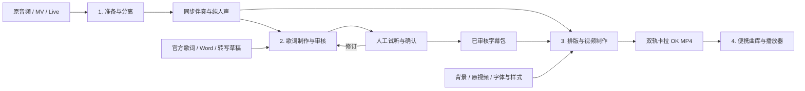

# 模块边界与制作流程

按 2026-09 本次整曲制作与播放器开发记录整理。项目分为**三个制作模块，加一个独立播放器**。下面区分已经存在的代码与待实现的交接接口；不是已经完成目录重构或新增 CLI 的声明。

## 四个模块

| 模块 | 输入 | 输出 | 工作性质 | 运行资源 |
| --- | --- | --- | --- | --- |
| 1. 音轨准备与分离 | 原音频、MV / Live；选定版本与片段；可选外部分轨 | 同一时间轴的原音频、伴奏、纯人声及分离报告 | 参数确定后自动执行，抽样试听验收 | 分离强烈建议 GPU；抽音频主要 CPU / I/O |
| 2. 歌词制作与审核 | 纯人声、已有歌词／Word、原音频或视频参考 | 经审核的歌词、读音、词／音拍时间、演唱者和入唱提示 | 自动处理 + AI 辅助 + 人工确认的循环 | ASR / 声学模型可用 GPU；文本处理、编辑和审核不依赖 GPU |
| 3. 字幕与视频制作 | 同步分轨、已审核字幕数据、原视频或背景、字体与样式 | 烧录字幕的双音轨 MP4 及验证报告 | 固定输入和规则后可自动重跑 | libass 字幕绘制与当前缩放在 CPU；NVENC 编码可用 GPU |
| 4. 曲库与播放器 | 卡拉 OK MP4、专辑／歌曲／版本信息 | 本地曲库、播放与混音 | 独立本地应用 | 普通 Mac / PC；不需要分离或转写模型 |



“确定性”在这里指无需每次重新做语义判断、可以固定输入后批处理，不承诺不同模型版本、硬件或编码器产生逐字节相同的文件。分离本身也是机器学习推理；它与模块 2 的主要区别是无需在正常执行中逐句做内容决策，而非是否用了 AI。

GPU 是执行后端，不作为模块间接口。模块 1 和模块 3 可以安排在同一台 GPU PC 上，仍应能各自重跑；模块 2 的声学计算也可在那台机器上执行。播放器独立部署到 Mac，不安装 PyTorch 或模型权重。

## 1. 音轨准备与分离

当前入口：`prepare`、`separate`，以及项目配置中导入外部 `vocals` / `instrumental`。实现分布在 `media.py` 与 `ml.py`。

当前交接文件为 `work/original.wav`、`work/vocals.wav`、`work/instrumental.wav` 和处理报告。本次已在本地 NVIDIA GPU 上使用 MDX23C-InstVoc HQ 处理整曲，模型评估见 [UVR 记录](uvr-evaluation.md)。CLI 默认模型仍是较小的 MDX，使用本次模型需显式指定：

```bash
auto-karaoke --project .local/demo/project.json prepare
auto-karaoke --project .local/demo/project.json separate --model MDX23C-8KFFT-InstVoc_HQ.ckpt
```

本模块不判断歌词、读音或歌手姓名。模型及参数确定后，可排队批处理；出轨后检查长度、时间零点、有限数值并试听分离质量。分离的纯人声可能有残留乐器，不能把“隔离人声”理解成绝对无伴奏泄漏。

同一首歌的专辑版、MV 剪辑版、Live 版是不同制作输入。不能把专辑版的人声对齐结果直接套到 Live 视频；每个版本应有自己的来源与时间轴。

## 2. 歌词制作与审核

当前入口：Word 导入脚本、可选 `transcribe`、`emit`、`align`、`beats`、歌词标注器、`singer-review`、`import-singers` 与手工 `overrides.json`。

这不是简单的“音轨进、JSON 出”，而是反复核对的编辑阶段：

1. 优先导入用户已有且版本匹配的歌词。ASR 只提供缺失文本或差异候选，不覆盖确认过的原文。
2. 确定显示原文、读音与实际唱法；英文按词，日语按音拍处理。汉字注音位置与文字中的假名边界分开表达。
3. 声学模型输出概率，强制对齐计算时间；根据试听修正重复副歌、拖音、抢拍、漏唱与分句。
4. 歌手标记来自人工编辑或已知来源；不确定身份保留未知。本次 Gemini 分唱结果未达到可靠程度，不把它当真值。模型研究见 [歌手识别评估](singer-identification.md)。
5. 结合原音频的节拍与实际入唱检查倒数提示；人声之外的节奏信息也是输入。
6. 预览后由人确认可以制作正式视频；回退或修改应保留已确认的其他内容。

AI 适合提出读音、文本差异、分句或异常时间的建议，也可以协助组织操作。它不应自由编造精确音拍时间或自动认定歌手身份。批量本地对齐应留给声学模型和算法，关键疑点回到试听。

当前 `emit` CLI 仍限制单段 60 秒。本次整曲制作完成不等于已经有通用的整曲自动切分、重复段落匹配及合并入口；这些编排需要收敛进代码。也尚无自动 AI 审核服务或完整图形时间轴编辑器。

### 当前数据与目标交接点

| 数据 | 当前实际载体 | 归属 |
| --- | --- | --- |
| 原文、读音、稳定行 / token ID | `lyrics.json` | 模块 2 的可编辑来源 |
| 词／音拍时间及声学证据 | `work/timing.json`、emissions 与报告 | 模块 2 的草稿和计算缓存 |
| 手工时间修正 | `overrides.json` | 模块 2 的审核结果 |
| 歌手身份、颜色及句子／词标记 | 标注歌词 JSON、`singer-map.json`、项目配置 | 模块 2 的标记，模块 3 的显示选项 |
| 音乐节拍 | `beats.json` | 模块 2 计算与核对；当前在字幕生成时也可补算 |
| 样式、背景、字体、标题卡 | `project.json` 中相关配置 | 模块 3 的制作参数 |

**下一步应增加一个显式导出、冻结审核结果的交接点。** 可以称为 `karaoke.json`，但当前没有这个统一格式、导出命令或审核状态门禁，不能把现有 `timing.json` 直接称为已审核成品。

建议字幕包保存：版本化 schema；来源／分轨指纹和时间原点；稳定行与词 ID；显示文字、读音、语言及音拍时间；歌手标记；已确认入唱提示；审核状态和必要的出处信息。字体文件、媒体本体及模型缓存留在 JSON 外；相对路径或资源 ID 引用。样式配置独立，改字大小、颜色开关和背景不需要重做歌词判断。

审核状态如 `draft → needs_review → approved` 属于待实现约定。正式导出应拒绝未解决的时间越界、轨道不匹配等结构问题；未知歌手可以明确保留，而非为了通过审核强行补姓名。

## 3. 字幕与视频制作

当前入口：`subtitles`、`render`、`replace-audio`；主要实现为 `subtitles.py`、`media.py`。

当前字幕生成仍会调用 `reviewed_timing()` 合并人工覆盖，读取歌手表，并通过 `project_cues()` 在缺少缓存时分析音乐节拍。因此现在的模块边界是逻辑划分，还没有做到只拿一个冻结字幕包即可运行。

目标是把这些判断结果固定在模块 2，模块 3 只做校验、排版、字幕动画、烧录和音轨封装。渲染阶段不转写、不重新识别歌手、不擅自重估音拍时间。ASS 是派生显示产物，不应成为歌词与时间的唯一来源。

本次已经验收的显示约定包括：

- 两排固定交替接唱，长间隔后从上排重新开始；汉字上方注音，英文词间保留空格。
- 无底部黑条、加粗描边；歌手配色可开关，换歌手显示 `【姓名】`。
- 三点在即将入唱的歌词前递减，每阶段至少一秒；最后一个点消失后再留一个节奏间隔。
- 开头与结尾各 10 秒标题卡覆盖原时间轴，不额外改变歌曲长度。
- 最终 MP4 默认伴奏，第二轨为 **Vocals / 纯人声**；`Original Mix` 是另一种明确选择，不能混为一谈。

当前 `render` 会先生成带原音频的中间视频，再替换伴奏、封装第二轨。这是实现细节；播放器只接收最终 MP4，不读取中间制作目录。本次交付过 12 首整曲双轨成品，但通用发布清单与批量验证流程仍需从本地制作记录中提炼成正式入口。

NVENC 加速的是 H.264 编码；当前 libass 绘制和缩放仍使用 CPU，也可以用 `libx264` 完成全流程。显式选择 NVENC 后不可用会报错。制作参数与字体版本也会影响视觉结果，应随交付记录。

## 4. 曲库与播放器

播放器已拆到独立仓库 [auto-karaoke-player](https://github.com/frip-fans/auto-karaoke-player)，拥有自己的 Git 历史、Python 依赖、Mac 启动脚本、打包工具和测试。两仓库通过 [最终 MP4 约定](player-contract.md) 衔接，不依赖彼此源码。

它只需要最终 MP4，不依赖 `lyrics.json`、分离 WAV、审核记录或制作模型。曲库用相对路径记录专辑、歌曲、版本与音轨映射；整库文件夹可搬移。点歌队列、最近唱过和音量偏好存在浏览器，不跟随曲库同步。

本地 FFmpeg 从 MP4 解码伴奏和纯人声到可重建缓存，Web Audio 用同一音频时钟混音；这一步是解码，不是重新做音轨分离。观众窗口只显示静音画面，控制窗口统一输出声音。

## 面向其他用户的复用与分发

已提供 **可独立运行的核心 CLI + 分阶段 skills + 一个 Codex plugin 源码包**。环境配置技能 `karaoke-setup`、三个制作技能、参考资料与安装脚本位于 [plugins/auto-karaoke](../plugins/auto-karaoke/README.md)，可按需独立安装；仓库 marketplace 清单位于 `.agents/plugins/marketplace.json`，已完成本地注册与插件安装验证，尚未上架公共插件目录。

Skill 描述代理何时使用某项能力、如何调用代码、如何处理结果与疑点，可携带脚本和参考资料；plugin 将多项能力打包供用户安装。两者可以组合，不需要二选一。官方定义见 [Build skills](https://learn.chatgpt.com/docs/build-skills) 与 [Plugins](https://learn.chatgpt.com/docs/plugins)。

| 已提供的独立 skill | 用户可单独复用的任务 | 调用代码与边界 |
| --- | --- | --- |
| `karaoke-setup` | 检查机器是否适合所选任务，经用户明确授权后安装／修复环境 | 独立诊断脚本检查 Python、FFmpeg、后端、编码器与字体；不需要先安装制作工具 |
| `audio-separate` | 给一段音频／视频，得到伴奏和纯人声；不要求制作卡拉 OK | 检查环境、选择模型、执行分离、验证分轨；不依赖歌词、字体或播放器 |
| `karaoke-author` | 已有分轨和歌词，制作并审核词／音拍级字幕数据 | 组织导入、读音、声学对齐、疑点清单、试听修正、审核结果导出；可接受其他工具的分轨 |
| `karaoke-render` | 已有确认后的字幕与分轨，批量制作卡拉 OK 视频 | 验证交接包、应用显示样式、生成预览／最终视频、核实音轨；不重新判断歌词 |

还可增加一个很薄的 `karaoke` 总入口：根据已有文件选择起始阶段、串联上述流程，避免用户每次理解所有命令。共同约定只保留一份，不在每个 skill 里复制整套安装、schema 和错误处理文档。

阶段 2 最适合把本次 run 中反复用到的判断整理为 skill：歌词版本核对、汉字与假名边界、英语词间空格、重复段落对齐、歌手未知状态，以及何时必须回到试听。阶段 1 和 3 的 skill 主要负责编排已测试的命令，数值运算和媒体处理留在代码中。

第一版 plugin 包含 skills、参考资料及安装脚本，没有 MCP 服务。需要从 Mac 调用远端 GPU PC、跨任务查询进度或多人共享 GPU 队列时，再考虑独立执行服务及 MCP 接口。安装 plugin 不等于提供 GPU、安装 CUDA 或分发模型权重；环境诊断脚本已随 `karaoke-setup` 提供，由 Codex 根据结果提出具体安装方案，得到用户明确授权后执行；普通制作请求不等于安装授权。

分离任务已经解除对 `lyrics` 配置的依赖：只提供媒体配置即可准备和分离，进入需要歌词的阶段时才明确报缺失。当前 renderer 仍依赖多份编辑态文件；下一步让它直接接受有版本和校验规则的字幕包。插件说明保留这一限制，不把技能包装等同于接口重构完成。

面向复用的验收场景应至少包括：

- 新用户在独立目录中只做分离，不需要原项目的歌词、字体或个人路径。
- 使用外部工具输出的分轨，从歌词制作阶段开始。
- 使用已审核字幕包直接渲染，不安装 ASR／对齐模型，也不调用外部 AI。
- 仅导入 MP4 到播放器，不安装制作工具链。
- 中断后继续工作、切换模型或重渲染时，保留人工确认的数据。

姓名与颜色、歌曲信息、背景、模型选择应成为用户参数或可选预设；本次 fripSide 约定可保留为预设，但不应成为其他用户的必填条件。模型、媒体与个人配置不装进分发包。CLI 继续可以直接使用，使不运行 Codex 的用户也能复用确定步骤。

## 代码组织与下一步顺序

目前保持现有 CLI 和文件路径兼容，先按职责理解代码：

| 边界 | 当前文件 |
| --- | --- |
| 共享项目、路径、时间约定 | `project.py`、`cli.py` |
| 音轨准备与分离 | `media.py` 中准备／抽音频；`ml.py::separate` |
| 歌词与审核 | `docx_lyrics.py`、`alignment.py`、`singers.py`、`singer_review.py`、`rhythm.py`；`ml.py` 中 ASR / emissions；`tools/lyric-annotator.html` |
| 渲染与封装 | `subtitles.py`；`media.py` 中编码、换轨与双轨封装 |
| 曲库与播放 | 独立仓库 [auto-karaoke-player](https://github.com/frip-fans/auto-karaoke-player) |

下一轮重构应先固定交接数据，再移动代码：

1. 设计、验证并导出已审核字幕包；增加制作版本与同步音轨的来源校验，避免错用旧时间轴。
2. 让字幕生成只读取冻结数据和样式，移出隐式节拍分析；保留现有项目格式的兼容入口。
3. 把本次整曲切分、对齐、审核和交付验证整理成可复用任务，支持按阶段恢复，不覆盖人工确认。
4. 再把混在 `ml.py` / `media.py` 的职责迁到 separation、authoring、rendering 等包；播放器继续独立。

仅移动目录不会解决交接问题。缓存失效也要按依赖处理：换背景只重渲染；改歌手标记只重字幕与视频；改读音需重新对齐受影响内容；换源版本或分轨需校验／重做相关时间轴；只改播放音量不回到制作流程。当前尚无覆盖所有依赖的自动失效系统，更换源素材仍应使用新的 `work_dir`。

源媒体、歌词、分轨、模型和曲库均留在本地忽略目录；制作代码、契约说明和合成测试进入 Git。
