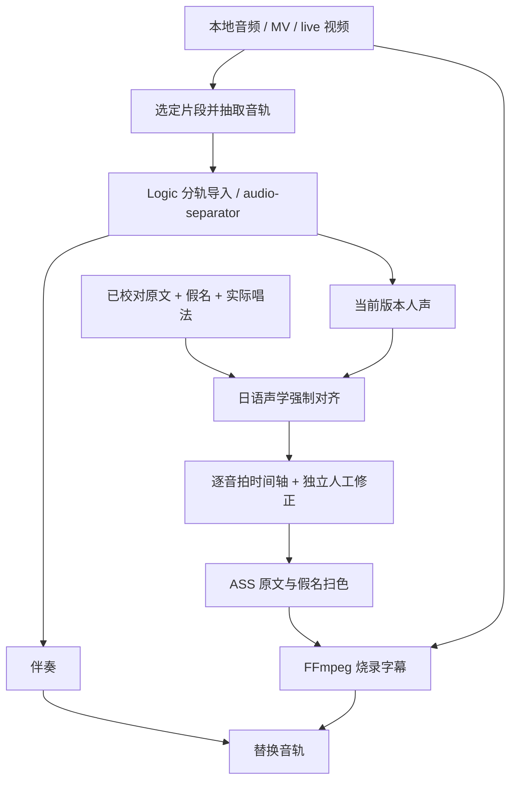

# Pipeline 设计与当前边界

## 数据流

ASR 是可选草稿入口，不自动升级成已校对歌词。歌词源优先使用用户已有的官方歌词册、官方页面或有明确来源的歌词页面，并在本地记录出处。现阶段没有实现歌词网站抓取器。

## 假名对齐为什么需要保留

“显示假名”与“实际发音”是两个字段的概念：例如助词字面写法与发音可以不同。模型对齐实际发音，视频展示用户确认的假名。不能把罗马字展示或整词亮起等同于假名逐音拍扫色。

目前原型使用 [NextFire 日语歌声模型](https://huggingface.co/NextFire/mms-300m-ForcedAligner-karaoke-ja-Latn)，对输入平假名分音拍，再转换为模型字表中的 Latin 发音字符。CTC Viterbi 保留每个字符的声学帧范围，聚合回音拍；短 blank 间隔最多按规则延展 0.22 秒以避免视觉闪烁。`raw_end` 保留原始对齐边界。

`\kf` 用于在已确定的时间段内从左向右扫色；它负责显示动画，不能创造缺失的音拍时间证据。参见 [ASS karaoke 标签](https://aegisub.org/docs/latest/ass_tags/#karaoke-effect)。当前 renderer 校正 Pillow 与 libass 字体度量差异以减少覆盖层错位；该校正只在 IPA Gothic 上完成实际画面检查。

## 两类输入

**录音室版本 / MV**：先选同一版本歌词；MV 的前奏、插入段与专辑音轨可能不同，必须以输入文件本身为时间基准。对齐人声和最终伴奏应源自同一时间轴。

**Live**：保留现场视频和现场伴奏；用当前演唱重新对齐。不要直接套录音室时间轴。现场可能有重复副歌、MC、观众声、即兴拖拍、歌词变化与多人重叠；这些需要现场文本、段落锚点和人工复核。当前原型只表达单路顺序演唱，不能覆盖两人同时唱不同歌词。

## 已实现与后续工作

已实现短片段素材准备、可选分离／转写、CTC 对齐、独立人工覆盖、双行注音字幕、视频烧录及伴奏替换。用户无需为换伴奏再次跑分离、对齐或视频编码。

尚需完成：

1. 本地 GPU 环境验收；依具体显卡与模型测显存、耗时和听感。
2. 与现成编辑器的时间轴适配。先验证每个假名音拍与人工锁定能否保留，再决定集成。
3. 整曲分段：以句子／段落锚点切分，输入上下文重叠；合并时恢复原文件时间并去重，防止重复副歌串位。
4. 发音规范：英语混唱、跨 token 促音、词典无法确定的艺术读法、多音拍覆盖；允许人工确认，不能仅靠自动猜测。
5. 完整来源指纹与依赖失效检测。目前检查 vocals 和歌词指纹；更换原素材仍需新建 `work_dir`，不是完整自动缓存系统。
6. 长时间拖音、合唱、两行交叠和字体回退的显示验收，以及整曲听音检查。

模型代码、权重、歌词、源视频是不同来源的内容。此仓库只保存我们的实验代码和文档；具体依赖与权重的使用条件应查对应上游，不把代码许可证概括成所有输入与模型的许可证。
